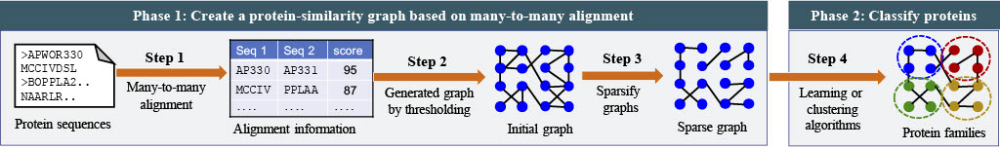

### File representations
#### Graph.txt
This file contains the graph structure in the following format, where each line represents an edge between 2 nodes and their edge weight.
These values are space delimited
```
node_a node_b weight_a_b
node_a node_c weight_a_c
.
.
.
```

#### labels.txt
This file contains the labels for each node in the graph. Each line contains space separated values of node name and its class as follows 

```
node_a class__of_node_a
node_b class__of_node_b
.
.
.
```

#### train_test_mask.pkl
This is a python pickle file which contains an array like data structure which is used to create train and test mask for the graph neural network.
The length of the array is equalt to number of nodes in the graph. The array contains integer values 1 and 2. 

Value 1 at index `i` means that node `i` belongs to the training set.

Value 2 at index `i` means that node `i` belongs to the test set.


### Instructions to run
To run use the following command
```
python base_pipeline.py --appropriate_args
```

The default setting can be run by following command

```
python base_pipeline.py --graph Graph.txt --labels label.txt --mask mask_split.pkl --one_indexed_classes
```


### Generating sparsified graphs from protien sequence fasta files.



We have added a shell script in example folder for easy creation of graphs from a fasta file of sequences. All you need is last-align software and networkx python library installed.

This run.sh file will create graphs for you using three different strategies mentioned in our paper. It will also generate a python pickle file named `name_to_ix_map.pkl`. This file can be used to create labels.txt file with integer mappings of each sequence.  This integer mapping is required to just easy the downstreaming process of classification.

Once this is done, we can use the commands mentioned above to run the `base_pipeline.py` file on appropriate graph, train-test mask and label file to get the results!


### Requirements

```
torch==1.5.1
torch-geometric==1.6.0
networkx==2.4
```
